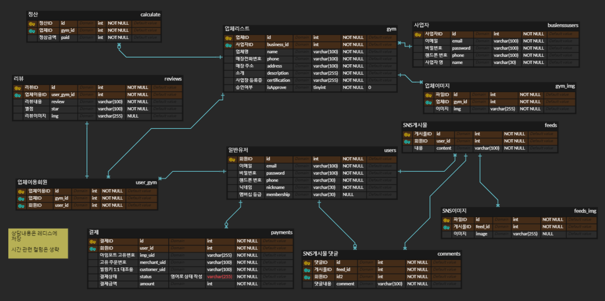

# 최종프로젝트 [Six Pack]

## **프로젝트 소개**

```
💡전국의 운동할 수 있는 시설을(헬스장, 필라테스 등) 중개하는 ‘식스팩‘ 이라는 플랫폼 서비스를 개발
```

## **서비스 기획 배경**

```
❓ 우리가 제공하고자 하는  ‘식스팩’ 서비스는

내 현재 위치에서 쉽게 운동하러 갈 수 있는 공간을 중개하는 플랫폼입니다.

많은 분들이 공감하실 텐데 여행이나 출장 등 타 지역에 갔을 때 헬스장 당일권 외에는 운동할 수단이 마땅치 않습니다. 운동은 하고 싶지만 당일권을 사기엔 부담이 됩니다. ‘식스팩’은 이러한 고민을 완전히 해소해 줍니다.

그리고 내 활동 반경 안에 여러 개의 헬스장을 이용할 수 있다는 건 생각보다 굉장한 만족감과 편안함을 줍니다. 식스팩은 전국 각지에 있는 하이 퀄리티 체육관들과 제휴하고 있고, 구독만 한다면 당신이 어디에 있든 당신과 가장 가까운 체육관에 가서 운동할 수 있습니다.

또한 우리 동네 어느 체육관을 다녀야 할지 고민된다면 주저 말고 한 달만 구독해보세요!

직접 가서 체험해보시고 선택해도 늦지 않습니다.

게다가 전국 헬스장 어디와 비교해도 합리적인 가격대를 자랑합니다.

지금 당장 신청해 보세요!
```

### **서비스 기획 아이데이션**


<br>

### ✨프로젝트 핵심 기능

-

<br>

### 📌역할분담

- **한정훈(팀장)**
  - ??
  - ??
- **김승일(부팀장)**
  - ??
  - ??
- **이효원**
  - ??
  - ??
- **정호준**
  - ??
  - ??
- **주현진**
  - ??
  - ??

<br>

### ✅최종 구현 범위

- **Swagger-openAPI**
  - /api : API Document
- **Auth**
  - POST :
  - GET :
- ??
  - POST :
  - GET :
  - PATCH :
  - DELETE :

<br>

### 👨‍💻기술 스택

 
 


<br>

### 🗂️폴더 구조

```
📦public
 ┣ 📂css
 ┃ ┣ 📜admin.css
 ┃ ┣ 📜adminApproveDetail.css
 ┃ ┣ 📜allGymstyle.css
 ┃ ┣ 📜businessMyInfo.css
 ┃ ┣ 📜feed.css
 ┃ ┣ 📜gym.css
 ┃ ┣ 📜gymDetail.css
 ┃ ┣ 📜header.css
 ┃ ┣ 📜main.css
 ┃ ┣ 📜mypage.css
 ┃ ┣ 📜postGym.css
 ┃ ┣ 📜postReview.css
 ┃ ┣ 📜qrcode.css
 ┃ ┣ 📜reset.css
 ┃ ┣ 📜user-login.css
 ┃ ┗ 📜_variables.css
 ┣ 📂images
 ┃ ┣ 📜close.png
 ┃ ┣ 📜crossfit-1.jpg
 ┃ ┣ 📜default_profile.png
 ┃ ┣ 📜feed-control.png
 ┃ ┣ 📜gym-1.jpg
 ┃ ┣ 📜gym-2.jpg
 ┃ ┣ 📜gym-3.jpg
 ┃ ┣ 📜gym-4.jpg
 ┃ ┣ 📜gym-5.jpg
 ┃ ┣ 📜kakao-talk.png
 ┃ ┣ 📜main-1.jpg
 ┃ ┣ 📜map-solid.svg
 ┃ ┣ 📜map.png
 ┃ ┣ 📜qr-code.svg
 ┃ ┣ 📜right-arrow.png
 ┃ ┣ 📜search.svg
 ┃ ┣ 📜star_rating_0.jpg
 ┃ ┣ 📜star_rating_1.jpg
 ┃ ┣ 📜star_rating_10.jpg
 ┃ ┣ 📜star_rating_2.jpg
 ┃ ┣ 📜star_rating_3.jpg
 ┃ ┣ 📜star_rating_4.jpg
 ┃ ┣ 📜star_rating_5.jpg
 ┃ ┣ 📜star_rating_6.jpg
 ┃ ┣ 📜star_rating_7.jpg
 ┃ ┣ 📜star_rating_8.jpg
 ┃ ┣ 📜star_rating_9.jpg
 ┃ ┗ 📜yoga-1.jpg
 ┗ 📂js
 ┃ ┣ 📜admin.js
 ┃ ┣ 📜adminApprove.js
 ┃ ┣ 📜adminApproveDetail.js
 ┃ ┣ 📜auth.js
 ┃ ┣ 📜businessMyInfo.js
 ┃ ┣ 📜comment.js
 ┃ ┣ 📜components.js
 ┃ ┣ 📜enrollFeed.js
 ┃ ┣ 📜enrollGym.js
 ┃ ┣ 📜feed.js
 ┃ ┣ 📜feedUpdate.js
 ┃ ┣ 📜gym.js
 ┃ ┣ 📜gymDetail.js
 ┃ ┣ 📜gymReview.js
 ┃ ┣ 📜gymUpdate.js
 ┃ ┣ 📜infinityScroll.js
 ┃ ┣ 📜jsQR.js
 ┃ ┣ 📜main.js
 ┃ ┣ 📜map.js
 ┃ ┣ 📜myInfo.js
 ┃ ┣ 📜myInfoBusiness.js
 ┃ ┣ 📜mypage.js
 ┃ ┣ 📜mypageBusiness.js
 ┃ ┣ 📜payment.js
 ┃ ┣ 📜postReview.js
 ┃ ┣ 📜qrcode.js
 ┃ ┣ 📜review.js
 ┃ ┣ 📜reviewDetail.js
 ┃ ┣ 📜searchGym.js
 ┃ ┣ 📜test.js
 ┃ ┣ 📜useHistory.js
 ┃ ┣ 📜user-gym-history.js
 ┃ ┗ 📜userList.js
 📦src
 ┣ 📂domain
 ┃ ┣ 📂admin
 ┃ ┃ ┣ 📂dto
 ┃ ┃ ┃ ┣ 📜approveGym.dto.ts
 ┃ ┃ ┃ ┣ 📜calculate.dto.ts
 ┃ ┃ ┃ ┣ 📜gymRank.dto.ts
 ┃ ┃ ┃ ┗ 📜monthData.dto.ts
 ┃ ┃ ┣ 📜admin.controller.spec.ts
 ┃ ┃ ┣ 📜admin.controller.ts
 ┃ ┃ ┣ 📜admin.decorators.ts
 ┃ ┃ ┣ 📜admin.module.ts
 ┃ ┃ ┣ 📜admin.service.spec.ts
 ┃ ┃ ┗ 📜admin.service.ts
 ┃ ┣ 📂auth
 ┃ ┃ ┣ 📂dto
 ┃ ┃ ┃ ┣ 📜kakaologinUser.dto.ts
 ┃ ┃ ┃ ┣ 📜loginUser.dto.ts
 ┃ ┃ ┃ ┣ 📜postBusinessUser.dto.ts
 ┃ ┃ ┃ ┗ 📜postUser.dto.ts
 ┃ ┃ ┣ 📂guard
 ┃ ┃ ┃ ┗ 📜jwt-access.guard.ts
 ┃ ┃ ┣ 📂strategy
 ┃ ┃ ┃ ┣ 📜jwt-access.strategy.ts
 ┃ ┃ ┃ ┣ 📜jwt-kakao.strategy.ts
 ┃ ┃ ┃ ┗ 📜jwt-refresh.strategy.ts
 ┃ ┃ ┣ 📂types
 ┃ ┃ ┃ ┗ 📜jwtPayload.type.ts
 ┃ ┃ ┣ 📂__test__
 ┃ ┃ ┃ ┣ 📜auth.controller.spec.ts
 ┃ ┃ ┃ ┗ 📜auth.service.spec.ts
 ┃ ┃ ┣ 📜auth.controller.ts
 ┃ ┃ ┣ 📜auth.decorators.ts
 ┃ ┃ ┣ 📜auth.module.ts
 ┃ ┃ ┗ 📜auth.service.ts
 ┃ ┣ 📂business-user
 ┃ ┃ ┣ 📂dto
 ┃ ┃ ┃ ┗ 📜updateBusinessUserInfo.dto.ts
 ┃ ┃ ┣ 📂__test__
 ┃ ┃ ┃ ┣ 📜business-user.controller.spec.ts
 ┃ ┃ ┃ ┗ 📜business-user.service.spec.ts
 ┃ ┃ ┣ 📜business-user.controller.ts
 ┃ ┃ ┣ 📜business-user.decorators.ts
 ┃ ┃ ┣ 📜business-user.module.ts
 ┃ ┃ ┗ 📜business-user.service.ts
 ┃ ┣ 📂feed
 ┃ ┃ ┣ 📂dto
 ┃ ┃ ┃ ┣ 📜create-comment.dto.ts
 ┃ ┃ ┃ ┣ 📜create-feeds.dto.ts
 ┃ ┃ ┃ ┣ 📜infinity.dto.ts
 ┃ ┃ ┃ ┣ 📜update-comment.dto.ts
 ┃ ┃ ┃ ┗ 📜update-feeds.dto.ts
 ┃ ┃ ┣ 📜feed.controller.spec.ts
 ┃ ┃ ┣ 📜feed.controller.ts
 ┃ ┃ ┣ 📜feed.decorators.ts
 ┃ ┃ ┣ 📜feed.module.ts
 ┃ ┃ ┣ 📜feed.service.spec.ts
 ┃ ┃ ┗ 📜feed.service.ts
 ┃ ┣ 📂gym
 ┃ ┃ ┣ 📂dto
 ┃ ┃ ┃ ┣ 📜deleteGym.dto.ts
 ┃ ┃ ┃ ┣ 📜gymImage.dto.ts
 ┃ ┃ ┃ ┣ 📜postGym.dto.ts
 ┃ ┃ ┃ ┗ 📜updateGym.dto.ts
 ┃ ┃ ┣ 📜gym.controller.spec.ts
 ┃ ┃ ┣ 📜gym.controller.ts
 ┃ ┃ ┣ 📜gym.decorators.ts
 ┃ ┃ ┣ 📜gym.module.ts
 ┃ ┃ ┣ 📜gym.service.spec.ts
 ┃ ┃ ┗ 📜gym.service.ts
 ┃ ┣ 📂payment
 ┃ ┃ ┣ 📂dto
 ┃ ┃ ┃ ┣ 📜complete.dto.ts
 ┃ ┃ ┃ ┣ 📜createPayment.dto.ts
 ┃ ┃ ┃ ┣ 📜unsubscribe.dto.ts
 ┃ ┃ ┃ ┗ 📜webhook.dto.ts
 ┃ ┃ ┣ 📜payment.controller.spec.ts
 ┃ ┃ ┣ 📜payment.controller.ts
 ┃ ┃ ┣ 📜payment.decorators.ts
 ┃ ┃ ┣ 📜payment.module.ts
 ┃ ┃ ┣ 📜payment.service.spec.ts
 ┃ ┃ ┗ 📜payment.service.ts
 ┃ ┣ 📂qrcode
 ┃ ┃ ┣ 📂__test__
 ┃ ┃ ┃ ┣ 📜qrcode.controller.spec.ts
 ┃ ┃ ┃ ┗ 📜qrcode.service.spec.ts
 ┃ ┃ ┣ 📜qrcode.controller.ts
 ┃ ┃ ┣ 📜qrcode.decorators.ts
 ┃ ┃ ┣ 📜qrcode.module.ts
 ┃ ┃ ┗ 📜qrcode.service.ts
 ┃ ┣ 📂review
 ┃ ┃ ┣ 📂dto
 ┃ ┃ ┃ ┣ 📜create-review.dto.ts
 ┃ ┃ ┃ ┗ 📜update-review.dto.ts
 ┃ ┃ ┣ 📂__test__
 ┃ ┃ ┃ ┣ 📜review.controller.spec.ts
 ┃ ┃ ┃ ┗ 📜review.service.spec.ts
 ┃ ┃ ┣ 📜review.controller.ts
 ┃ ┃ ┣ 📜review.decorators.ts
 ┃ ┃ ┣ 📜review.module.ts
 ┃ ┃ ┗ 📜review.service.ts
 ┃ ┗ 📂user
 ┃ ┃ ┣ 📂dto
 ┃ ┃ ┃ ┗ 📜updateUserInfo.dto.ts
 ┃ ┃ ┣ 📂__test__
 ┃ ┃ ┃ ┣ 📜user.controller.spec.ts
 ┃ ┃ ┃ ┗ 📜user.service.spec.ts
 ┃ ┃ ┣ 📜user.controller.ts
 ┃ ┃ ┣ 📜user.decorators.ts
 ┃ ┃ ┣ 📜user.module.ts
 ┃ ┃ ┗ 📜user.service.ts
 ┣ 📂global
 ┃ ┣ 📂common
 ┃ ┃ ┣ 📂decorator
 ┃ ┃ ┃ ┣ 📜current-user-at.decorator.ts
 ┃ ┃ ┃ ┣ 📜current-user-rt.decorator.ts
 ┃ ┃ ┃ ┣ 📜current-user.decorator.ts
 ┃ ┃ ┃ ┣ 📜decorator.ts
 ┃ ┃ ┃ ┗ 📜public.decorator.ts
 ┃ ┃ ┣ 📂interceptor
 ┃ ┃ ┃ ┗ 📜undifinedToNull.interceptor.ts
 ┃ ┃ ┗ 📂utils
 ┃ ┃ ┃ ┗ 📜multer.options.factory.ts
 ┃ ┣ 📂config
 ┃ ┃ ┗ 📜ormConfig.ts
 ┃ ┣ 📂entities
 ┃ ┃ ┣ 📂common
 ┃ ┃ ┃ ┣ 📜enums.ts
 ┃ ┃ ┃ ┣ 📜gym.isApprove.ts
 ┃ ┃ ┃ ┣ 📜payment.isCancel.ts
 ┃ ┃ ┃ ┣ 📜payment.status.ts
 ┃ ┃ ┃ ┗ 📜user.membership.ts
 ┃ ┃ ┣ 📜adminusers.ts
 ┃ ┃ ┣ 📜Busienssusers.ts
 ┃ ┃ ┣ 📜Calculate.ts
 ┃ ┃ ┣ 📜Comments.ts
 ┃ ┃ ┣ 📜entity.sql
 ┃ ┃ ┣ 📜Feeds.ts
 ┃ ┃ ┣ 📜FeedsImg.ts
 ┃ ┃ ┣ 📜Gym.ts
 ┃ ┃ ┣ 📜GymImg.ts
 ┃ ┃ ┣ 📜Payments.ts
 ┃ ┃ ┣ 📜Reviews.ts
 ┃ ┃ ┣ 📜UserGym.ts
 ┃ ┃ ┗ 📜Users.ts
 ┃ ┣ 📂exception
 ┃ ┃ ┗ 📜http-exception.ts
 ┃ ┣ 📂logger
 ┃ ┃ ┗ 📜my-logger.ts
 ┃ ┣ 📂swagger
 ┃ ┃ ┗ 📜swagger-document.ts
 ┃ ┗ 📂util
 ┃ ┃ ┣ 📜multer.ontions.ts
 ┃ ┃ ┣ 📜multer.options.ts
 ┃ ┃ ┗ 📜util.ts
 ┣ 📜app.controller.spec.ts
 ┣ 📜app.controller.ts
 ┣ 📜app.module.ts
 ┗ 📜main.ts
 📦test
 ┣ 📜.eslintrc.js
 ┣ 📜app.e2e-spec.ts
 ┗ 📜jest-e2e.json
📦views
 ┣ 📂admin
 ┃ ┣ 📜admin.ejs
 ┃ ┣ 📜adminApprove.ejs
 ┃ ┗ 📜adminApproveDetail.ejs
 ┣ 📂auth
 ┃ ┣ 📜admin-login.ejs
 ┃ ┣ 📜business-login.ejs
 ┃ ┣ 📜business-signup.ejs
 ┃ ┣ 📜user-login.ejs
 ┃ ┣ 📜user-qrcode.ejs
 ┃ ┗ 📜user-signup.ejs
 ┣ 📂components
 ┃ ┣ 📜footer.ejs
 ┃ ┣ 📜head.ejs
 ┃ ┗ 📜header.ejs
 ┣ 📂feeds
 ┃ ┣ 📜comment.ejs
 ┃ ┣ 📜createFeed.ejs
 ┃ ┣ 📜feed.ejs
 ┃ ┗ 📜feedUpdate.ejs
 ┣ 📂gym
 ┃ ┣ 📜gymDetail.ejs
 ┃ ┣ 📜gymList.ejs
 ┃ ┣ 📜gymReview.ejs
 ┃ ┣ 📜postGym.ejs
 ┃ ┣ 📜searchGym.ejs
 ┃ ┣ 📜updateGym.ejs
 ┃ ┣ 📜usegym.ejs
 ┃ ┗ 📜userList.ejs
 ┣ 📂main
 ┃ ┣ 📜main.ejs
 ┃ ┗ 📜paymentComplete.ejs
 ┣ 📂mypage
 ┃ ┣ 📜businessMyInfo.ejs
 ┃ ┣ 📜myinfo.ejs
 ┃ ┣ 📜myinfoBusiness.ejs
 ┃ ┣ 📜myMembership.ejs
 ┃ ┣ 📜mypage.ejs
 ┃ ┣ 📜mypageBusiness.ejs
 ┃ ┣ 📜paymentDetails.ejs
 ┃ ┗ 📜usegym-history.ejs
 ┣ 📂review
 ┃ ┣ 📜postReview.ejs
 ┃ ┣ 📜reviewDetail.ejs
 ┃ ┗ 📜reviewList.ejs
 ┣ 📜index.ejs
 ┣ 📜qrScan.ejs
 ┗ 📜test.ejs
```

<br>

### 👀코드 컨벤션

- **패키지 관리**
  - 패키지 매니저는 npm을 사용합니다
  - 패키지를 추가할 경우 단일 커밋으로 기록합니다
- **커밋 관리**
  | 커밋 유형 | 의미 |
  | ---------------- | ------------------------------------------------------------ |
  | Feat | 새로운 기능 추가 |
  | Fix | 버그 수정 |
  | Docs | 문서 수정 |
  | Style | 코드 formatting, 세미콜론 누락, 코드 자체의 변경이 없는 경우 |
  | Refactor | 코드 리팩토링 |
  | Test | 테스트 코드, 리팩토링 테스트 코드 추가 |
  | Chore | 패키지 매니저 수정, 그 외 기타 수정 ex) .gitignore |
  | Design | CSS 등 사용자 UI 디자인 변경 |
  | Comment | 필요한 주석 추가 및 변경 |
  | Rename | 파일 또는 폴더 명을 수정하거나 옮기는 작업만인 경우 |
  | Remove | 파일을 삭제하는 작업만 수행한 경우 |
  | !BREAKING CHANGE | 커다란 API 변경의 경우 |
  | !HOTFIX | 급하게 치명적인 버그를 고쳐야 하는 경우 |

  - 제목 첫 글자는 대문자로, 끝에는 `.` 금지

  - 제목은 영문 기준 50자 이내로 할 것

  - 여러가지 항목이 있다면 글머리 기호를 통해 가독성 높이기

    ```
    - 변경 내용 1
    - 변경 내용 2
    - 변경 내용 3
    ```

- **네이밍 컨벤션**
  - 폴더 이름은 **케밥 케이스**`-`를 준수하며 용도에 따라 `.`으로 구분합니다
  - 클래스 이름은 **파스칼 케이스**를 사용합니다
  - 메서드는 **카멜 케이스**를 사용합니다

<br/>

### 🖼️ERD



<br />

### 🖼️API

[API 명세서 링크](https://www.notion.so/API-f10d0029614e4b68bc74fb133560245d)

## 😊프로젝트 시작 방법

이 섹션에서는 프로젝트 시작 방법에 대해서 설명합니다

### 패키지 설치

```
npm install
```

### 환경설정 구성

```
PORT=포트번호
DB_HOST=host주소
DB_USERNAME=
DB_PASSWORD=
DB_DATABASE=
JWT_ACCESS_TOKEN_SECRET=
JWT_ACCESS_TOKEN_EXPIRATION_TIME=
JWT_REFRESH_TOKEN_SECRET=
JWT_REFRESH_TOKEN_EXPIRATION_TIME=
KAKAO_CLIENT_ID=
KAKAO_CLIENT_SECRET=
KAKAO_CALLBACK_URL=
AWS_BUCKET_REGION=ap-northeast-2
AWS_BUCKET_NAME=버킷이름
AWS_ACCESS_KEY_ID=액세스 키 ID
AWS_SECRET_ACCESS_KEY=비밀 액세스 키
KAKAO_JAVASCRIPT_KEY=
IMP_CODE=아임포트 가맹점 식별코드
IMP_REST_API_KEY=아임포트 REST API Key
IMP_REST_API_SECRET_KEY=아임포트 REST API Secret
ADMIN_EMAIL=
ADMIN_PASSWORD=
NGROK_URL=
```

### NestJS 앱 실행

```
npm run start:dev
```
